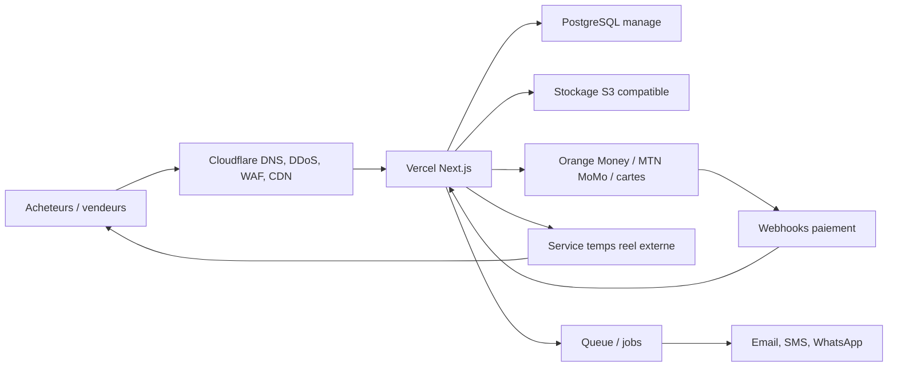

# Architecture production evolutive

## Vue d'ensemble

## Frontend et application

- Vercel heberge Next.js App Router.
- Les pages publiques peuvent etre statiques ou ISR.
- Les espaces acheteur, vendeur et admin utilisent SSR avec controle de session.
- Les mutations sensibles passent par Route Handlers ou Server Actions avec verification serveur.

## PostgreSQL

Provider recommande: Neon, Supabase, Railway, Crunchy Bridge ou AWS RDS.

Tables principales:

- `users`
- `roles`
- `user_roles`
- `seller_profiles`
- `buyer_profiles`
- `documents`
- `categories`
- `items`
- `item_inspections`
- `auctions`
- `bids`
- `deposits`
- `payments`
- `escrow_ledger`
- `seller_payouts`
- `refunds`
- `disputes`
- `reports`
- `notifications`
- `cities`
- `invoices`
- `audit_logs`

Regles:

- Toutes les ecritures financieres sont append-only dans `escrow_ledger`.
- Les changements critiques creent un `audit_logs`.
- Les offres d'enchere utilisent transaction SQL, verrou optimiste ou contrainte sur prix courant.

## Temps reel

Utiliser un service externe manage pour eviter de maintenir des WebSockets dans des fonctions serverless:

- Ably;
- Pusher;
- Liveblocks;
- Supabase Realtime;
- Cloudflare Durable Objects si l'on choisit Cloudflare pour la coordination.

Flux:

1. L'acheteur soumet une offre via API Next.js.
2. L'API verifie identite, telephone, caution et palier.
3. PostgreSQL enregistre l'offre dans une transaction.
4. L'API publie `bid.accepted` dans le service temps reel.
5. Les clients recoivent le nouveau prix et le compte a rebours.

## Stockage fichiers

- Cloudflare R2 ou AWS S3.
- Buckets prives pour KYC, factures et preuves de propriete.
- URLs signees a duree courte.
- Images publiques seulement apres validation admin.
- Scan antivirus ou moderation avant publication.

## Paiements Mobile Money

Integrations:

- Orange Money API;
- MTN MoMo API;
- carte bancaire via PSP local ou Stripe si disponible;
- virement bancaire et paiement manuel valide par finance.

Flux caution:

1. Creation d'une intention de paiement.
2. Paiement Mobile Money.
3. Webhook signe recu.
4. Verification serveur.
5. Credit `deposit_hold` dans `escrow_ledger`.
6. Autorisation d'encherir.

Flux achat:

1. Paiement gagnant ou achat immediat.
2. Fonds marques comme bloques.
3. Livraison ou retrait confirme.
4. Commission plateforme calculee.
5. Reversement vendeur declenche par finance.

## Securite applicative

- RBAC strict pour admin, finance, verification et support.
- 2FA obligatoire pour comptes administratifs.
- OTP telephone pour acheteurs et vendeurs.
- Validation serveur des montants, paliers et statuts.
- Webhooks signes et idempotents.
- Journaux d'audit pour paiements, litiges et validations.
- Rate limiting sur auth, OTP, bids, payments et webhooks.
